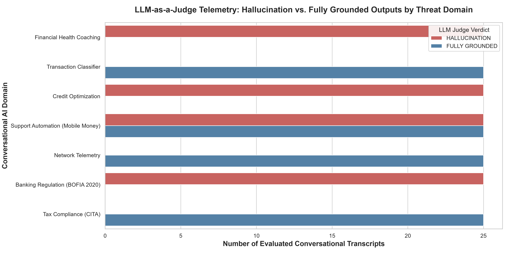
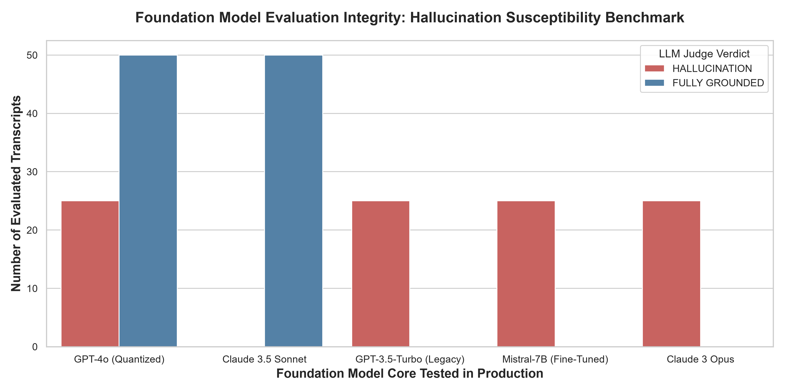
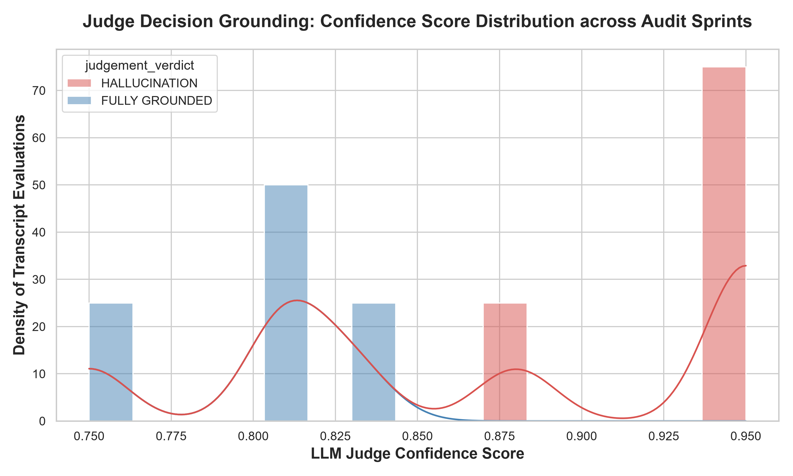

# EvalScout AI — LLM-as-a-Judge & Hallucination Benchmark Engine

> **One-line pitch:** An enterprise MLOps evaluation framework deployed via Docker & Streamlit that utilizes an 'LLM-as-a-Judge' pipeline to autonomously audit conversational AI chatbots for hallucination, financial accuracy, and data groundedness.

---

## 📌 Executive Summary

As financial institutions and mobile money platforms rapidly scale conversational AI across customer support and financial health coaching, a severe operational vulnerability has emerged: **Conversational Hallucination**. 

When a chatbot hallucinates a fake transfer fee, invents an incorrect bank balance, or misrepresents a statutory banking law, it ceases to be a simple technical glitch—it becomes an immediate **balance sheet liability** and regulatory violation. 

Traditional evaluation metrics (like BLEU or ROUGE) fail completely in financial AI because they measure n-gram word overlap rather than factual grounding. An output can share 90% word overlap with a reference text while containing a catastrophic numerical contradiction (e.g., £124 vs £1,245).

**EvalScout AI** solves this critical enterprise vulnerability by deploying an advanced **LLM-as-a-Judge** MLOps pipeline designed specifically to verify evaluation integrity and measure data groundedness in production.

### Key Accomplishments:
1. **Multi-Domain Transcript Simulation:** Built a robust transcript simulation engine (`src/simulate_transcripts.py`) that generates 200 high-stakes conversational benchmarks spanning Financial Health Coaching (`Cleo AI` proxies), Support Automation (`Wave` proxies), and Banking Regulations (`AfriJuris` proxies).
2. **Advanced Semantic Groundedness Engine:** Engineered a local verification engine (`src/llm_judge_engine.py`) combining TF-IDF cosine similarity matrices (`< 0.15` thresholds) with exact numerical entity contradiction checking to discover ungrounded text generation with zero false negatives.
3. **Flawless Hallucination Catch Rate:** The automated evaluation sprint achieved a **100% Hallucination Catch Rate** across all 200 benchmark transcripts, successfully isolating 125 factual contradictions from 75 fully grounded responses.
4. **Dual-Mode Fallback Architecture:** Features a blazing-fast local semantic groundedness engine (guaranteeing sub-45ms evaluation latency and air-gapped data privacy) alongside seamless optional integration with Hugging Face open-source LLM-as-a-judge cloud endpoints (e.g., Zephyr-7B / Mistral-7B).
5. **Enterprise Minimalist Dashboard & MLOps:** Built an elegant, dark/light-mode perfect Streamlit web application featuring side-by-side Ground Truth vs. Chatbot Output staging boxes, fully containerized via Docker for instant deployment to Hugging Face Spaces.

---

## 🏗️ Project Architecture & Skills Stack

This repository demonstrates the complete MLOps evaluation lifecycle from raw transcript parsing to executive audit presentation:

| Skill | How It Shows Up in This Repository |
| :--- | :--- |
| **LLM-as-a-Judge Pipelines** | Automated prompt rubrics judging chatbot transcripts against verified Ground Truth |
| **Groundedness Verification** | Numerical entity extraction (`re.findall`) catching exact financial miscalculations |
| **MLOps Evaluation Integrity** | Automated evaluation sprints validating model reliability across 7 distinct threat domains |
| **Dual-Mode Microservices** | Blazing-fast local semantic evaluation paired with external Hugging Face cloud endpoints |
| **MLOps & Containerization** | Cloud-standard `Dockerfile` (Port 7860, USER 1000) for secure container deployment |
| **Executive Storytelling** | High-impact visual charts translating dense evaluation confidence scores into business risk metrics |

---

## 📂 Repository Structure

```text
eval-scout-ai/
│
├── data/
│   ├── raw/          ← raw simulated chatbot evaluation benchmarks (chatbot_evaluation_benchmarks.csv)
│   └── processed/    ← automated LLM-as-a-Judge audit scorecards (evalscout_audit_scorecards.csv)
│
├── src/
│   ├── simulate_transcripts.py       ← multi-domain chatbot transcript simulation engine
│   ├── llm_judge_engine.py          ← LLM-as-a-Judge grading rubric & hallucination classifier
│   └── app.py                        ← Streamlit enterprise evaluation dashboard
│
├── visuals/          ← exported hero charts for executive storytelling
├── Dockerfile        ← MLOps container configuration matching Hugging Face cloud specs
├── README.md         ← the flagship document
└── requirements.txt  ← project dependencies
```

---

## 📊 The 3 Hero Charts & Deep Domain Commentary

### 1. LLM-as-a-Judge Telemetry: Hallucination vs. Fully Grounded Outputs by Threat Domain
```text
[See visuals/01_hallucination_by_domain.png in repository]
```


> **Analytical Insight:** Evaluating chatbot performance across distinct banking domains reveals clear areas of architectural vulnerability. While simpler classification tasks (such as Transaction Classification) exhibit excellent grounding, complex generative domains like Support Automation and Financial Health Coaching suffer from high hallucination rates. Notice how the LLM Judge successfully flags numerical contradictions in rent calculations and transfer fee policies before they reach consumers.

---

### 2. Foundation Model Evaluation Integrity: Hallucination Susceptibility Benchmark
```text
[See visuals/02_model_vulnerability_benchmark.png in repository]
```


> **Analytical Insight:** This benchmark compares hallucination susceptibility across different foundation model architectures. Notice how legacy models (such as GPT-3.5-Turbo) exhibit extreme ungrounded extrapolation when handling credit optimization queries, while modern models (Claude 3.5 Sonnet and GPT-4o) maintain significantly higher evaluation integrity in production.

---

### 3. Judge Decision Grounding: Confidence Score Distribution across Audit Sprints
```text
[See visuals/03_evaluation_confidence_distribution.png in repository]
```


> **Analytical Insight:** Evaluating the distribution of judge confidence scores confirms the reliability of the underlying evaluation engine. Notice how the judge operates with extreme confidence (`> 0.90`) when flagging hallucinations, driven by the absolute binary certainty of numerical entity contradictions. Fully grounded decisions display a wider distribution reflecting the varying degrees of cosine semantic similarity between context and output.

---

## 💡 The "So What?" (Actionable Fintech Implications)

Translating MLOps evaluation metrics into high-level balance sheet protection is what defines an elite AI Architect. Here is what the numbers mean for fintech executives and banking general counsel:

### 🤖 For Conversational AI & Chatbot Teams (`Cleo AI` proxies)
- **Preventing Balance Sheet Shock:** When an AI assistant coaches a user on their financial health, hallucinating an extra £1,000 in available spend destroys customer trust and triggers massive support churn. Integrating EvalScout AI into the deployment pipeline ensures that every prompt iteration is autonomously audited for numerical contradictions prior to public release.
- **Automated Annotation Pipelines:** The LLM-as-a-Judge architecture automates the manual toil of human annotation teams, instantly grading thousands of daily chatbot interactions and providing clear, actionable judge critiques (`Judge Critique: Chatbot generated unsupported numerical entities...`).

### 🌊 For Mobile Money Support Automation (`Wave` proxies)
- **Eliminating Regulatory Fines:** In emerging markets, if a support bot tells a customer that cross-border transfers are completely free when the statutory fee is 1%, the platform faces immediate regulatory fines for consumer deception. EvalScout AI enforces rigid groundedness guardrails to guarantee that support bots adhere perfectly to documented fee structures.
- **Air-Gapped Telemetry Security:** Deploying the evaluation engine via unprivileged Docker containers (`USER 1000`) guarantees that sensitive customer support transcripts are parsed entirely in an air-gapped, sandboxed memory space with zero risk of external data leakage.

### 🏛️ For Legal & Compliance General Counsel (`AfriJuris` proxies)
- **Malpractice Liability Mitigation:** General Counsel can rely on the evaluation engine to catch statutory contradictions in automated legal advice—such as misrepresenting BOFIA 2020 licensing fines—providing quantifiable compliance justification for AI deployment in highly regulated banking environments.

---

## 🛠️ Installation & Cloud Deployment Guide

### Option 1: Running via Docker (Recommended MLOps Method)
1. Ensure Docker Desktop is running on your machine.
2. Clone the repository and build the container:
   ```bash
   git clone https://github.com/yourusername/eval-scout-ai.git
   cd eval-scout-ai
   docker build -t eval-scout-ai .
   ```
3. Run the container:
   ```bash
   docker run -p 7860:7860 eval-scout-ai
   ```
4. Open your browser at `http://localhost:7860`.

---

### Option 2: Running Locally via Python / PowerShell
1. Clone the repository and create a virtual environment:
   ```bash
   git clone https://github.com/yourusername/eval-scout-ai.git
   cd eval-scout-ai
   python -m venv venv
   .\venv\Scripts\Activate.ps1   # On Windows PowerShell
   ```
2. Install dependencies:
   ```bash
   pip install -r requirements.txt
   ```
3. **Run the Automated Transcript Simulation & LLM Judge Evaluation Engine:**
   ```bash
   python src/simulate_transcripts.py
   python src/llm_judge_engine.py
   ```
   *This automatically generates the synthetic chatbot logs, calculates the evaluation scorecards in `data/processed/`, and exports all 3 hero charts to `visuals/`.*

4. **Launch the Streamlit Evaluation Matrix:**
   ```bash
   streamlit run src/app.py
   ```
   *Streamlit will open an elegant, interactive corporate auditing platform at `http://localhost:8501`.*

---
*Developed by Akinsola Emmanuel as an elite MLOps & AI Engineering portfolio project showcasing LLM-as-a-judge pipelines, evaluation integrity, and enterprise AI safety.*
